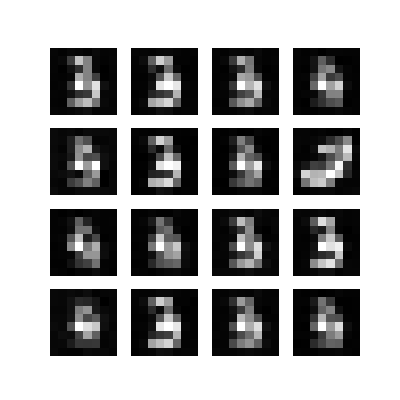
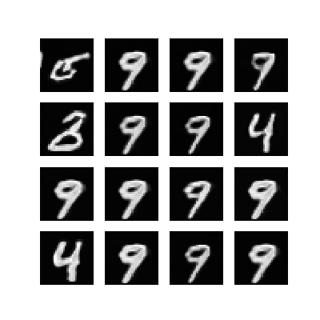
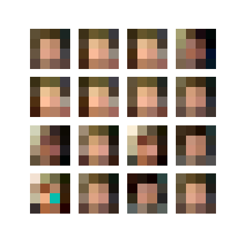
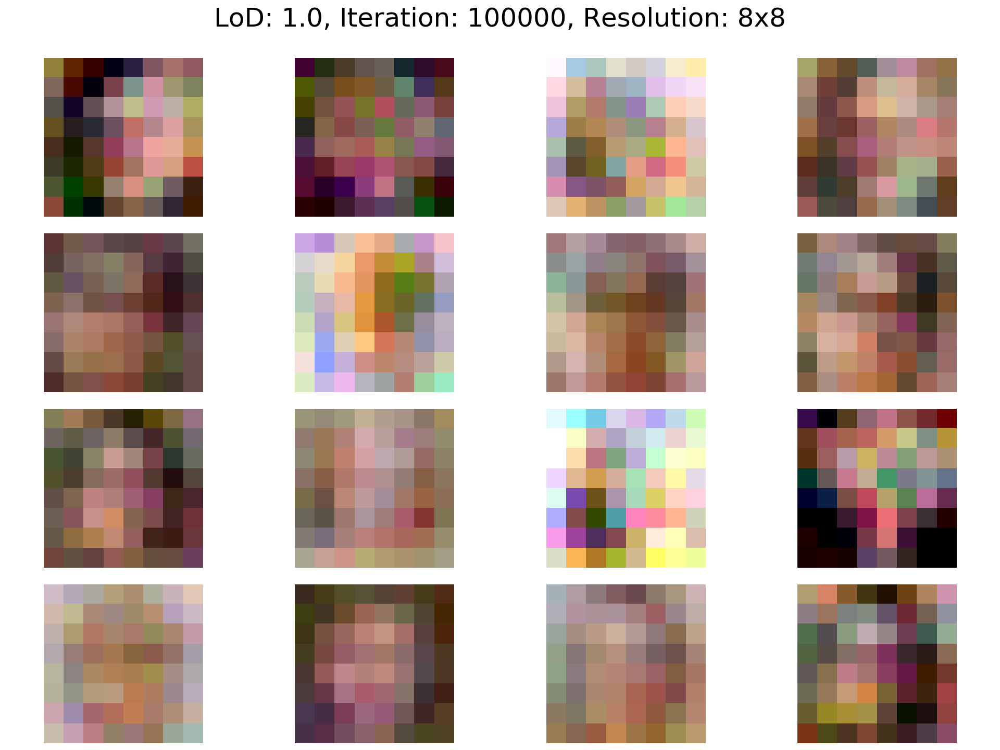
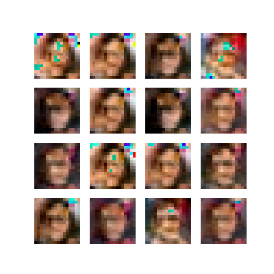
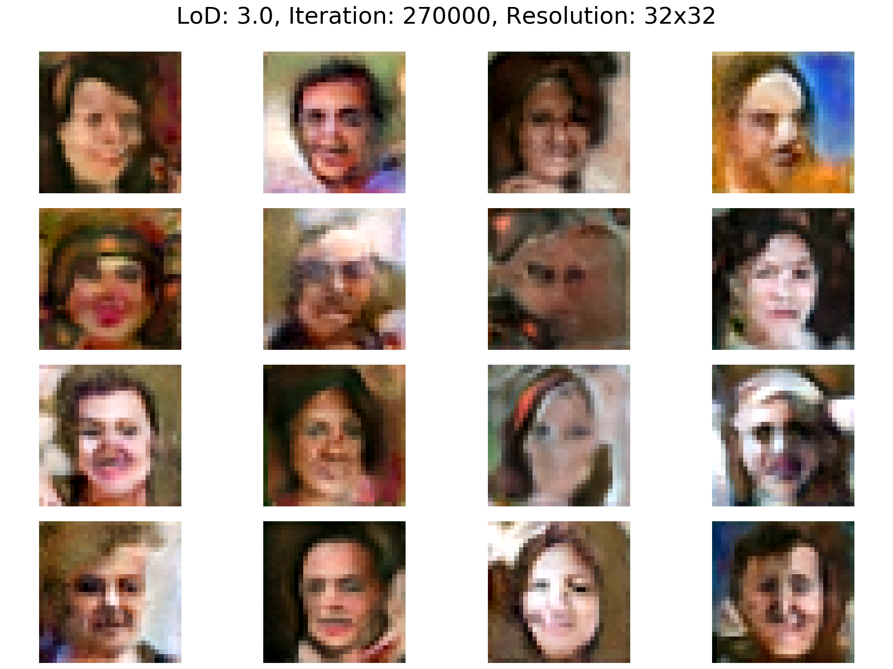

# style-gan

 
Resolution: 8x8, Dataset: MNIST

 
Resolution: 32x32, Dataset: MNIST

 
Resolution: 4x4, Dataset: FFHQ, After 5.000 * 16 Images

 
Resolution: 8x8, Dataset: FFHQ, After 16.000 * 16 Images

 
Resolution: 16x16, Dataset: FFHQ, After 37.000 * 16 Images

 
Resolution: 32x32, Dataset: FFHQ, After 67.000 * 16 Images

